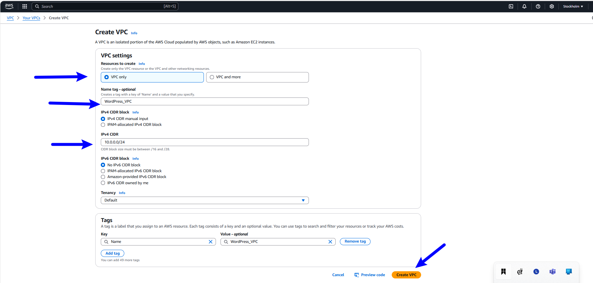
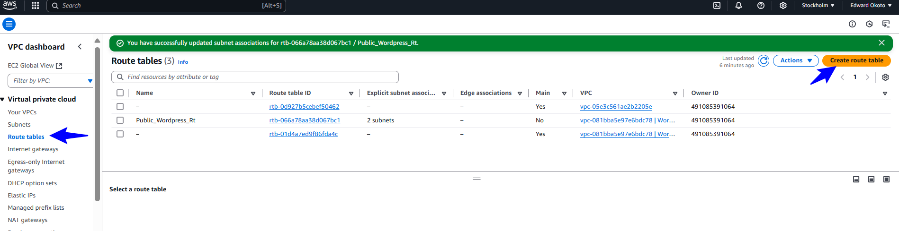
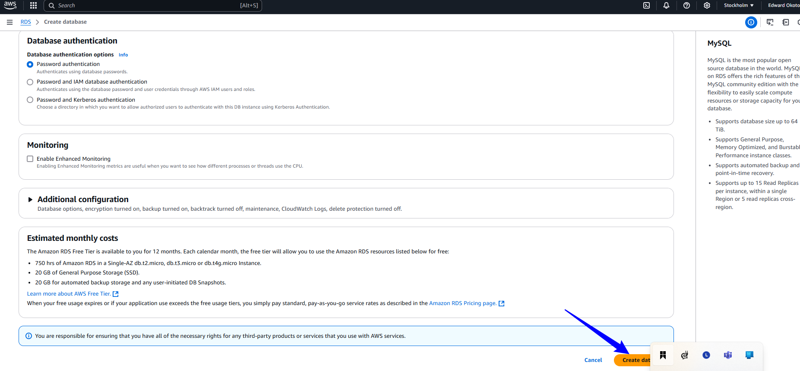

# WordPress Site For AWS

### Project Scenario

A small and medium sized digital marketing agency "DigitalBoost" wants to enhance its online presence by creating a high performance wordPress based site for their clients. The agency needs a scalable, secure, and cost- effective solution that can handle increasing traffic and seamlessly integrate with existing infrastructure.

### Project Objective

Design and Implement a Wordpress Solution using various AWS services,such as Networking,Compute,Object storage and Databases.

## PRACTICAL

## VPC Set-Up

Create Virtual Private Network (VPC) to isolate and secure for the WordPress Infrastructure

* Login to AWS account and search for VPC and click VPC.

    

* Name and define IP range for the VPC,then click `Create VPC`

    

* Create VPC with public and private subnets.On the subnet    section,click `Create subnet`

   

## Create Subnets

* Public subnet 1.

  * Name = `Public_WordPress_01`

  * Choose the newly created Wordpress VPC

  * choose a CIDR of `10.0.0.0/28`

  * Choose availabilty zone of `eu-north-1a`

  Public subnet 2.

  * Name = `Public_WordPress_02b`

  * Choose the newly created Wordpress VPC

  * choose a CIDR of `10.0.0.16/28`

  * Choose availabilty zone of `eu-north-1b`

  Private subnet 1.

  * Name = `Private_WordPress_01a`

  * Choose the newly created Wordpress VPC

  * choose a CIDR of `10.0.0.32/28`

  * Choose availabilty zone of `eu-north-1a`

  Private subnet 2.

  * Name = `Private_WordPress_02a`

  * Choose the newly created Wordpress VPC

  * choose a CIDR of `10.0.0.48/28`

  * Choose availabilty zone of `eu-north-1a`

  Private subnet 3.

  * Name = `Private_WordPress_01b`

  * Choose the newly created Wordpress VPC

  * choose a CIDR of `10.0.0.64/28`

  * Choose availabilty zone of `eu-north-1b`

  Private subnet 4.

  * Name = `Private_WordPress_02b`

  * Choose the newly created Wordpress VPC

  * choose a CIDR of `10.0.0.80/28`

  * Choose availabilty zone of `eu-north-1b`

   
   
   
## Create Route tables

* Configure route table for each of the subnets.

  On the Route table section,click `Create route table`.

    
    

 
  Public Route table

   * Choose the name of the public subnets route table,and attach it to the created VPC and click `Create route table`

     

    * Choose `Subnet associations` and click `Edit subnet association`

      

    * Select the public subnets and click `Save associations`

      
      

  Private Route table

   * Choose the name of the private subnets route table,and attach it to the created VPC and click `Create route table`.

      
      

  * Choose `Subnet associations` and click `Edit subnet association`

    

    * Select the private subnets and click `Save associations`

    
    

## Create Internet Gateway

* Locate the `Internet gateway` section and click `Create internet gateway`

  
  

* Attach the Internet gateway to a VPC

   

* Select the created VPC for WordPress and click `Attach internet gateway`

     
      

* Select the Public route table,Edit the route and allow all subnets 0.0.0.0/0 and point it to the created `Internet gateway`

    
     

## Create a NAT gateway

 * Locate the NAT gateway section and click `Create nat gateway`

     

 * Choose a name for the nat gateway,choose a public subnet you want it connected to,allocate elastic IP and click Create.
      
      

* Edit the private route table and point it to the nat gateway.

  
  
  

## Set up EC2 instances and attach them to private subnets

* On the search bar, type EC2 and click on `EC2`

  

* Click on launch instance

  

* Create EC2 instances for WebServer and DatabaseServer.

   Webserver.
   * Name it Webserver
   * Choose Amazon Linux (ami)
   * Edit Network settings,select Wordpress VPC 
   * Select private network in eu-North-1a availability zone.

  
  

   DatabaseServer
   * Name it Databaseserver
   * Choose Amazon Linux (ami)
   * Edit Network settings,select Wordpress VPC 
   * Select private network in eu-North-1b availability zone.

  
  

  

## AWS MySQL RDS Setup

* Navigate to RDS:

  In the Services menu, search for RDS and select it.

  

* Create a Database:

  Click on Create database.

  

  Choose a Database Creation Method:

  Select Standard Create.

  Select Engine:

  Choose MySQL as the database engine.

  

  Specify DB Details:

  Engine version: Choose the desired version of MySQL.

  Templates: Select the appropriate template (e.g., Free tier, Production).

  Settings:

  DB instance identifier: Provide a unique identifier for your DB instance.

  

  Master username: Enter a username for the master user.

  Master password: Enter and confirm a strong password.

  

  DB Instance Size:

  Select the instance class based on your requirements (e.g., db.t2.microfor free tier).

  Storage:

  Configure the storage settings (e.g., allocated storage size, storage type).

   

  Connectivity:

  Virtual Private Cloud (VPC): Select the VPC in which to launch your DB instance.

  Subnet group: Choose the appropriate subnet group.

  

  Publicly accessible: Choose whether the DB instance should be publicly accessible.

  VPC security groups: Select or create security groups to allow inbound traffic to the DB instance.

  

  Additional Configuration:

  Database name: Specify a name for your initial database.

  Backup: Configure automated backup settings.

  Monitoring: Enable enhanced monitoring if needed.

  Maintenance: Set the preferred maintenance window.

  

  Create Database:
 
  Review the settings and click Create database.

  

  ## EFS Set-up for WordPress Files

  Create an EFS File System:

  Go to the Elastic File System (EFS) console in the AWS Management Console.

  

  Click Create file system.

  Provide a name for your file system,Choose WordPress VPC and click Customize and select the Performance mode (Standard or Max I/O).

  Choose the Throughput mode (Provisioned or Bursting).

  Select the Encryption settings if needed.

  

  Click Next.

  
  

  Create a Security Group for EFS:

  Go to the EC2 console and select Security Groups.

    

  Create a new security group and add inbound rules to allow NFS traffic from your EC2 instances.

    

  Create Mount Targets:

  In the EFS console, select your file system and click Create mount target.

  Choose the availability zones where your EC2 instances are located.

  Select the security group you created earlier.
    
    
  